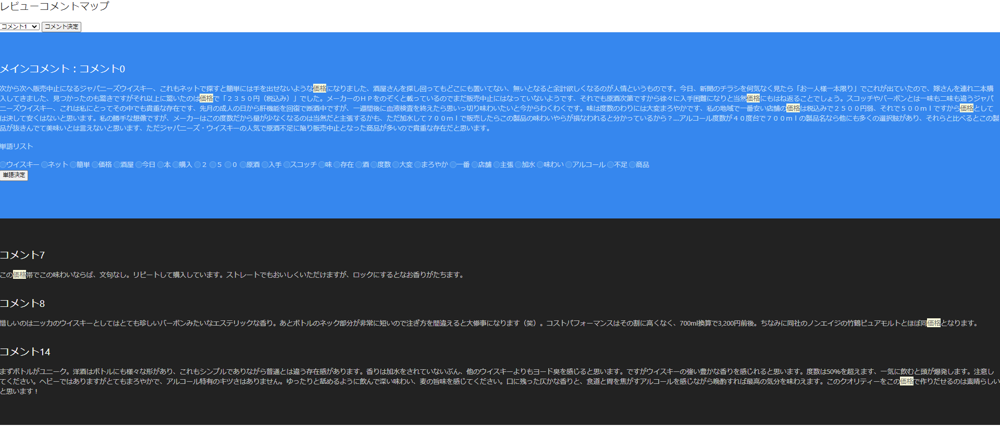

<h1>価格.comレビューコメントtoMap</h1>
2021/05/25
レビューコメントを取得して必要なデータは揃えられるようになっているが、CSSなどで綺麗に表示することは実装中。 
 

<h2>概要</h2>

価格.comの昇進レビューリンクからコメントを収集して、同じ単語を持っているコメント同士を紐づけしてマップ化する 
 

<h2>サンプル</h2>

<a href="https://review.kakaku.com/review/K0000695816/#tab">フロムザバレル(ウィスキー)のサンプル画像</a>

  

<h2>使用技術など</h2>

<ul>
<li>Python3
<li>BeautifulSoup
<li>Flask
<li>MeCab
<li>MongoDB
<li>UIkit
</ul>